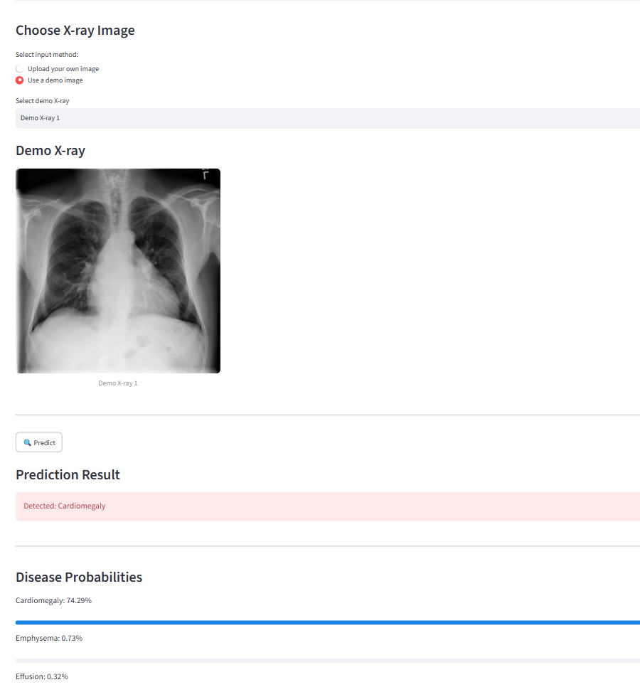
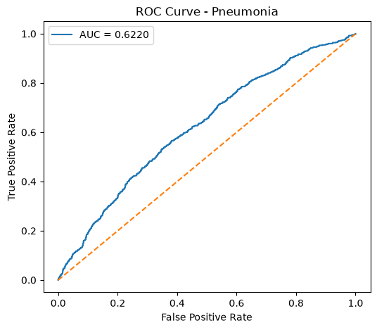

# Chest X-ray Disease Classification using Deep Learning

A deep learning-based multi-label chest X-ray classification system that detects 14 thoracic diseases from chest X-ray images using a DenseNet121 model trained on the NIH ChestX-ray14 dataset.

The project includes:
- Model training using PyTorch
- Multi-label classification
- Model evaluation using medical imaging metrics
- Optimized threshold selection
- Inference pipeline
- Interactive Streamlit web application

---

# Project Demo




## Live Demo

Streamlit App:
<https://chest-xray-disease-detection-akhhyawqungdt53tstlnij.streamlit.app/>

GitHub Repository:
<https://github.com/HarishChaisir/Chest-XRay-Disease-Detectionk>

# Overview

Chest X-ray interpretation is a challenging medical imaging task requiring expertise and experience. This project explores the use of deep learning for assisting chest X-ray analysis by predicting possible diseases from radiographic images.

The model treats this as a **multi-label classification problem**, meaning a single X-ray image can contain multiple diseases simultaneously.

The model predicts probabilities for 14 different thoracic conditions and applies optimized classification thresholds to generate final predictions.

---

# Diseases Detected

The model predicts the following diseases:

| Disease |
|---|
| Atelectasis |
| Cardiomegaly |
| Consolidation |
| Edema |
| Effusion |
| Emphysema |
| Fibrosis |
| Hernia |
| Infiltration |
| Mass |
| Nodule |
| Pleural Thickening |
| Pneumonia |
| Pneumothorax |

---

# Model Architecture

## DenseNet121

The project uses DenseNet121 with transfer learning.

Architecture:

Image
|
DenseNet121 (ImageNet pretrained)
|
Modified Classification Layer
|
14 Output Classes
|
Sigmoid Activation
|
Disease Probabilities


Changes made:

- Original DenseNet classifier replaced with a 14-output linear layer
- Sigmoid activation used for multi-label prediction
- Validation-based threshold optimization used instead of default 0.5 threshold

---

## Dataset

This project uses the **NIH ChestX-ray14 dataset** for training and evaluation.

The dataset contains over **100,000 frontal-view chest X-ray images** with labels for **14 thoracic disease categories**. Since this dataset is large and has specific usage terms, it is **not included in this repository**.

Dataset source: https://www.kaggle.com/datasets/nih-chest-xrays/data

### Dataset Preparation

After downloading the dataset, organize the files according to the project structure expected by the training pipeline.

The dataset includes:

- Chest X-ray images
- Disease labels
- Patient information
- Train/test split information

The model treats the task as a **multi-label classification problem**, where a single image can contain multiple disease labels simultaneously.

# Evaluation Results

The model was evaluated using a separate test set.

Final evaluation:

| Metric | Score |
|---|---:|
| AUROC | 0.736 |
| F1 Score | 0.263 |
| Precision | 0.188 |
| Recall | 0.482 |
| Accuracy | 0.086 |

## ROC Curves (Per Disease)

ROC curves were generated individually for each disease class.

Example:



# Project Structure

```text
Chest_XRay_Project/

│
├── app/
│   ├── Chest_X-ray_AI.py
│   └── pages/
│       ├── 1_About.py
│       ├── 2_Model_Performance.py
│       └── 3_How_It_Works.py
│
├── src/
│   ├── dataset.py
│   ├── model.py
│   ├── train.py
│   ├── evaluate.py
│   └── inference.py
│
├── models/
│   ├── best_model.pth
│   └── best_threshold.json
│
├── outputs/
│   ├── metrics/
│   │   ├── overall_scores.csv
│   │   ├── disease_auc_scores.csv
│   │   ├── disease_f1_scores.csv
│   │   ├── disease_precision.csv
│   │   └── disease_recall.csv
│   │   
│   ├── roc_curves/
│   │   └── *.png
│   │
│   └── confusion_matrices/
│       └── *.png
│
├── assets/
│   └── app_screenshot.png
│
├── requirements.txt
└── README.md
```
````markdown
## Installation

### Clone the Repository

```bash
git clone <repository-url>

cd Chest_XRay_Project
````

### Create a Virtual Environment

```bash
python -m venv chest_env
```

Activate the environment:

**Windows**

```bash
chest_env\Scripts\activate
```

### Install Dependencies

Install all required packages:

```bash
pip install -r requirements.txt
```

---

## Running the Application

Start the Streamlit web application:

```bash
streamlit run app/Chest_X-ray_AI.py
```

The application provides an interactive interface where users can:

* Upload a chest X-ray image
* Run deep learning inference
* View predicted diseases
* View confidence probabilities for all detected classes

---

## Technologies Used

| Category                | Technologies          |
| ----------------------- | --------------------- |
| Programming Language    | Python                |
| Deep Learning Framework | PyTorch, Torchvision  |
| Machine Learning        | Scikit-learn          |
| Data Processing         | NumPy, Pandas, Pillow |
| Visualization           | Matplotlib            |
| Deployment              | Streamlit             |

---

## Training Configuration

| Parameter          | Value                                 |
| ------------------ | ------------------------------------- |
| Model Architecture | DenseNet121                           |
| Input Image Size   | 224 × 224 pixels                      |
| Task               | Multi-label Classification            |
| Loss Function      | Binary Cross Entropy with Logits Loss |
| Optimizer          | Adam                                  |
| Learning Rate      | 1e-4                                  |

---

## Future Improvements

Potential improvements and extensions:

* Add Grad-CAM visualization for model interpretability
* Experiment with advanced architectures such as EfficientNet and ConvNeXt
* Improve handling of class imbalance
* Develop a FastAPI backend service
* Containerize the application using Docker
* Deploy the model using cloud infrastructure

---

## Disclaimer

This project is developed for educational and research purposes only.

The model is **not intended for clinical diagnosis** and should not be used as a replacement for professional medical evaluation.

---

## Author

**Harish Chaisir**

GitHub: <https://github.com/HarishChaisir>

LinkedIn: <https://www.linkedin.com/in/harish-chaisir>

Email: <chaisirharish337@gmail.com>
